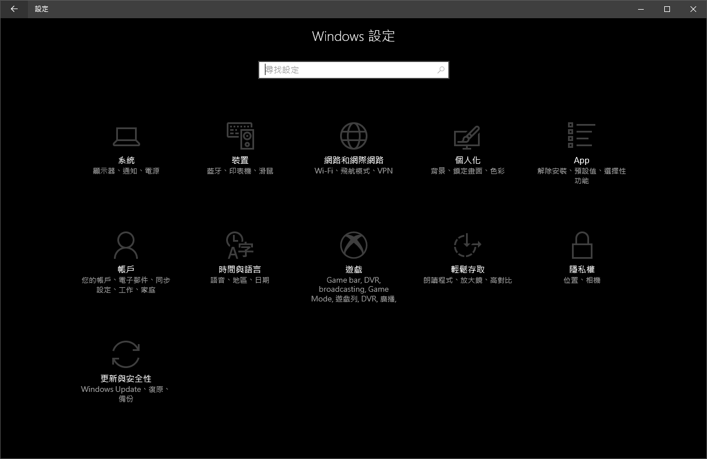
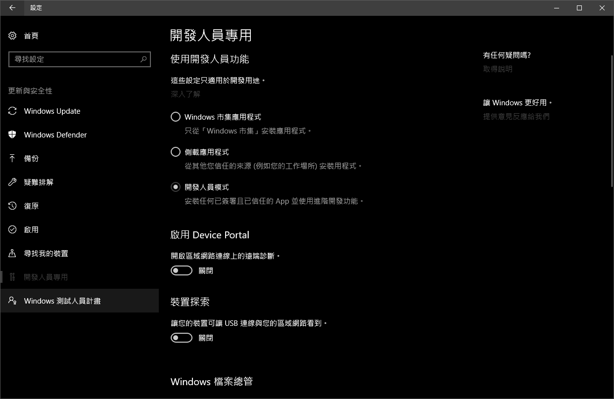
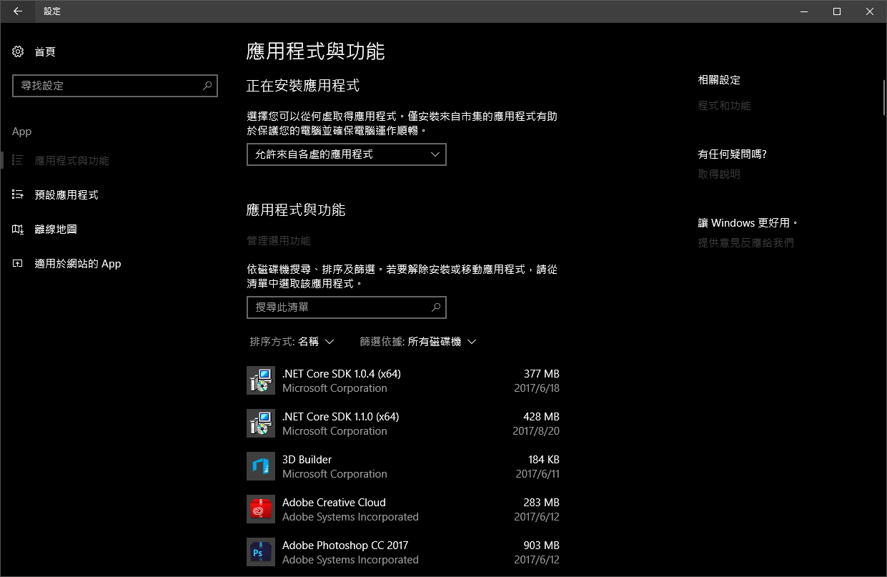

# Windows Subsystem for Linux
## 他是什麼，能吃嗎
* Windows Subsystem for Linux（簡稱WSL）是一個為在Windows 10上能夠原生運行Linux二進制可執行文件（ELF格式）的兼容層。
* 它是由微軟與Canonical公司合作開發，目標是使純正的Ubuntu 16.04 "Xenial Xerus"映像能下載和解壓到用戶的本地計算機，並且映像內的工具和實用工具能在此子系統上原生運行。
* WSL提供了一個微軟開發的Linux兼容內核接口（不包含Linux代碼），使得Linux用戶模式的二進制文件能在其上執行。
* 運行原理很像是Linux上Wine的Windows版。
## 官方Github Reop
* https://github.com/Microsoft/BashOnWindows/
* 如果遇到bug或是想要有新的feature，請上去發Issues。
## Release Note
* https://msdn.microsoft.com/en-us/commandline/wsl/release_notes?f=255&MSPPError=-2147217396
* 可以在這裡看到最新的Windows Inside中，WSL被改進了什麼東西，和出現了什麼bug。
## 安裝方法
* 以下僅考慮正式Release的Windows版本(Insider請去看Release Note)
* 如果你的電腦不是Intel的64位元架構的話(例如x86、arm架構)
    * 請買新電腦
* 如果你的Windows OS組建低於14393
    * 請升級您的Windows
    * https://support.microsoft.com/en-us/help/3159635/windows-10-update-assistant
* 如果你的Windows OS組建是14393
    * 我還是建議升級您的Windows，因為這個版本的功能不是很完整，使用時會遇到很多坑
    * 如果真的要安裝可以，請參考15063的WSL安裝方法
    * https://support.microsoft.com/en-us/help/3159635/windows-10-update-assistant
* 如果你的Windows OS組建是15063
    * 請打開Windows【設定】(快捷鍵 Win+I )  
      
    * 打開【更新與安全性】，進去【開發人員專用】分頁，勾選【開發人員模式】  
      
    * 這時系統可能會叫你重開機，如果有的話，請重開  
    * 進到【設定】裡的【APP】，然後點選畫面右方(有時會在畫面最下方)的【程式與功能】  
      
    * 然後點選【開啟或關閉 Windows 功能】，在裡面找到【適用於 Linux 的 Windows 子系統(搶鮮版 (Beta))】勾選後按【確定】  
      
    * 跑了一陣子之後 Windows 會叫你重新開機，然後請重新開機。  
    * 重開機完後，叫出【執行】(快捷鍵 Win+R )，輸入【bash】後按確定  
      
    * 接下來他會問一推問題，請依照需求回答，例如使用者帳號密碼之類的。  
    * 以後要打開他可以直接叫出【執行】(快捷鍵 Win+R )，輸入【bash】後按確定後打開。  
        * 其執行檔位置在【C:\Windows\System32\bash.exe】
    * WSL的管理方法
    ```
    lxrun

    在 LX 子系統上執行系統管理作業

    使用方式:
        /install - 安裝子系統
            選擇性引數:
                /y - 不提示使用者接受或建立子系統使用者
        /uninstall - 解除安裝子系統
            選擇性引數:
                /full - 執行完整解除安裝
                /y - 不提示使用者確認
        /setdefaultuser - 設定 bash 將以其身分啟動的子系統使用者。若該使用者不存在，將會建立該使用者。
            選擇性引數:
                username - 提供使用者名稱
                /y - 若提供使用者名稱，不提示建立密碼
        /update - 更新子系統的套件索引
    ```
* 如果你的Windows OS組建是16215以上
    * 可以到Windows Store上下載WSL
    * Ubuntu https://www.microsoft.com/en-us/store/p/ubuntu/9nblggh4msv6
    * openSUSE Leap 42 https://www.microsoft.com/en-us/store/p/opensuse-leap-42/9njvjts82tjx
    * SUSE Linux Enterprise Server 12 https://www.microsoft.com/en-us/store/p/suse-linux-enterprise-server-12/9p32mwbh6cns
## 注意事項
* 當最後一個 bash.exe 結束的時候，就會把所有WSL的程序結束(包含背景執行的)，因此當有背景執行的 WSL 程式時，記得不要把所有的 bash.exe 都關掉。
* 因為 WSL 沒有 systemd，因此裝在系統上的服務不會自己開起來，要手動的打開
```
sudo service XXX-service start
```
* 使用 gdb 的時候，有時候某些 libary 載入到記憶體上的位置會和正常的Linux不一樣，因此打 CTF 的 Pwn 時，在 WSL 上的結果很有可能不符合預期。
## 額外的東西
* ssh server
    * 跟Windows 10內建的 ssh server 衝突，所以記得要改Port或是關 Windows10 的 ssh 功能
    * 安裝 ssh-server
    ```
    sudo apt install openssh-server
    ```
    * 修改【/etc/ssh/sshd_config】內的這些東西
    ```
    AllowUsers <yourusername>
    PasswordAuthentication yes
    UsePrivilegeSeparation no
    ```
    * 然後要手動啟動 ssh-server 他
    ```
    sudo service ssh --full-restart
    ```
* 圖形介面
    * 我個人推薦使用的 X Server 是 VcXsrv Windows X Server
        * https://sourceforge.net/projects/vcxsrv/
    * 安裝完之後請在啟動裡面加入有內容的 .bat 檔，讓 X Server 可以每次開機都直接啟動
        * 開啟啟動資料夾可以直接【執行】【shell:startup】
    ```
    @echo 0
    start "" "C:\Program Files\VcXsrv\vcxsrv.exe" :0 -ac -terminate -lesspointer -multiwindow -clipboard -wgl
    exit
    ```
    * 然後進到 bash 裡面，在使用者的環境變數裡面增加
    ```
    DISPLAY=127.0.0.1:0
    ```
    * 如果使用```DISPLAY=:0```的話，本機上沒有問題，但是```ssh -X```的時候就會出現問題。
    * 加入環境變數的方法有很多種，我個人的做法是在【~/.bashrc】裡面加入。
    ```
    export DISPLAY=127.0.0.1
    ```
* Ubuntu Desktop
    * 裝上這個，你就有 firefox、gnome-terminal、gedit、Libre Office 等等東西可以用了
    ```
    sudo apt install ubuntu-desktop
    ```
* Hime
    * 參考這個
        * http://goodjack.blogspot.tw/2013/08/linux-phonetic-setting.html
    * 不過有幾點要注意，第一個是要開啟【支援遠端用戶端程式】
    * 然後在 VcXsrv 中 Ctrl-Space這個組合鍵無法使用，因此需替換成 Shift-Space
    * 最後記得加上以下的環境變數
    ```
    export GTK_IM_MODULE=hime
    export QT_IM_MODULE=hime
    ```
* 聲音
    * 我個人的做法是安裝pulse audio，然後這裡有別人編好的版本
        * https://github.com/kitor/wsl/raw/master/pulse6.zip
    * 然後解壓縮後執行裡面的```bin/pulseaudio.exe```
    * 接下來回到 bash 裡面，執行
    ```
    sudo add-apt-repository ppa:therealkenc/wsl-pulseaudio
    sudo apt install --no-install-recommends libpulse0 pavucontrol

    ```
    * 如果還有問題請參考這裡 https://github.com/Microsoft/BashOnWindows/issues/486
* VLC
    * 這個純粹就只是為了好玩用的，不一定要裝 :P
    ```
    sudo apt install vlc
    ```
    * bash 中輸入 vlc 打開之後
    * 【Tools】->【Video】->【Output】->【Color ASCII art video output】->【OK】
    * 把 vlc 關掉
    * 把環境變數的 ```DISPLAY``` 刪掉(或是改成空字串)
    * 執行
    ``` 
    cvlc <影片位置> 
    ```
    * 欣賞漂亮的 ASCII Art 吧
